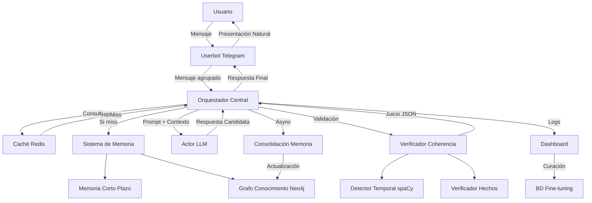

# Arquitectura del Sistema - Bot Provisional

## Visión General

Bot Provisional es un sistema de chatbot con memoria persistente diseñado para mantener conversaciones coherentes y naturales a lo largo del tiempo. La arquitectura se basa en un sistema de "conciencia" con cuatro principios fundamentales:

1. **Percepción** (Entrada): Recepción y comprensión natural de la comunicación
2. **Memoria** (Contexto): Acceso a múltiples capas de memoria para construir contexto
3. **Juicio** (Salida Verificada): Autocrítica para evaluar respuestas y asegurar coherencia
4. **Supervisión y Evolución**: Transparencia y gestión humana para mejora continua

## Componentes Principales

### 1. Userbot de Telegram
- **Responsabilidad**: Interfaz de comunicación con el usuario
- **Funciones**:
  - Recepción de mensajes
  - Agrupación inteligente de mensajes (debouncing)
  - Presentación natural de respuestas (typing simulation, globos de texto)
- **Tecnología**: Telethon

### 2. Orquestador Central
- **Responsabilidad**: Coordinación de todos los componentes del sistema
- **Funciones**:
  - Gestión del flujo de mensajes
  - Ensamblaje de prompts dinámicos
  - Coordinación entre Actor y Crítico
  - Gestión de caché y memoria
- **Tecnología**: FastAPI, Python asyncio

### 3. Sistema de Memoria

#### 3.1 Memoria a Corto Plazo
- **Función**: Contexto de la sesión actual
- **Tecnología**: Redis
- **Datos**: Mensajes recientes, estado de conversación

#### 3.2 Memoria a Largo Plazo
- **Función**: Grafo de conocimiento persistente
- **Tecnología**: Neo4j
- **Datos**: Hechos, relaciones, historial de interacciones

#### 3.3 Caché de Contexto
- **Función**: Optimización de respuestas recurrentes
- **Tecnología**: Redis
- **Estrategia**: CAG (Context-Aware Generation) avanzado

### 4. Motor de Generación (Actor)
- **Responsabilidad**: Generación creativa de respuestas
- **Función**: Producir "respuestas candidatas" basadas en el contexto
- **Tecnología**: OpenAI GPT-4 / Anthropic Claude

### 5. Agente Verificador de Coherencia (Crítico)
- **Responsabilidad**: Validación de respuestas antes de enviarlas
- **Funciones**:
  - Detección de afirmaciones temporales (spaCy)
  - Verificación contra hechos conocidos
  - Emisión de juicios en formato JSON
- **Tecnología**: spaCy, LLM secundario

### 6. Dashboard de Gestión
- **Responsabilidad**: Supervisión y curación del sistema
- **Funciones**:
  - Visualización de conversaciones en tiempo real
  - Métricas de uso (tokens, costos)
  - Edición y curación de respuestas
  - Configuración de parámetros
- **Tecnología**: FastAPI, HTML/CSS/JS

### 7. Base de Datos de Fine-tuning
- **Responsabilidad**: Almacenamiento de conversaciones curadas
- **Función**: Acumular ejemplos de alta calidad para mejora del modelo
- **Tecnología**: PostgreSQL

## Flujo de Datos

## Flujo de Trabajo Detallado

### Paso 1: Percepción
1. Usuario envía mensaje(s) a través de Telegram
2. Userbot recibe y agrupa mensajes inteligentemente
3. Envío al Orquestador Central

### Paso 2: Optimización con Caché
1. Orquestador consulta caché Redis
2. Si hay coincidencia, usa contexto pre-calculado
3. Si no, continúa con construcción de contexto

### Paso 3: Construcción del Contexto
1. Consulta Memoria a Corto Plazo (sesión actual)
2. Consulta Memoria a Largo Plazo (grafo de conocimiento)
3. Ensambla contexto relevante

### Paso 4: Generación Creativa
1. Orquestador crea prompt dinámico
2. Envía a LLM principal (Actor)
3. Recibe "Respuesta Candidata"

### Paso 5: Verificación de Coherencia
1. Detección de afirmaciones temporales/fácticas
2. Recuperación de hechos relevantes del grafo
3. Invocación del Agente Verificador
4. Emisión de juicio sobre coherencia

### Paso 6: Decisión y Corrección
1. Si respuesta es válida: proceder
2. Si hay incoherencias: bucle de corrección con Actor
3. Máximo 3 intentos de corrección

### Paso 7: Respuesta al Usuario
1. Envío de respuesta validada al Userbot
2. Presentación natural (simulación de escritura, división en globos)

### Paso 8: Consolidación de Memoria
1. Proceso asíncrono (Celery)
2. Extracción de nuevos hechos
3. Actualización del grafo de conocimiento

### Paso 9: Supervisión y Curación
1. Logging completo en Dashboard
2. Visualización de métricas
3. Posibilidad de edición y curación
4. Almacenamiento en BD de fine-tuning

## Consideraciones de Diseño

### Escalabilidad
- Arquitectura basada en microservicios
- Comunicación asíncrona donde sea posible
- Caché distribuido para optimización

### Confiabilidad
- Sistema de reintentos para componentes críticos
- Logging exhaustivo para debugging
- Fallbacks para cada componente

### Seguridad
- Autenticación en todos los endpoints
- Encriptación de datos sensibles
- Validación de entrada en todos los puntos

### Mantenibilidad
- Código modular y desacoplado
- Configuración centralizada
- Tests unitarios e integración

## Stack Tecnológico

### Backend
- **Lenguaje**: Python 3.10+
- **Framework Web**: FastAPI
- **ORM**: SQLAlchemy
- **Task Queue**: Celery

### Bases de Datos
- **SQL**: PostgreSQL
- **Cache**: Redis
- **Grafo**: Neo4j

### ML/NLP
- **NLP**: spaCy
- **LLMs**: OpenAI API, Anthropic API

### Frontend (Dashboard)
- **Framework**: FastAPI + Jinja2
- **CSS**: Tailwind CSS
- **JS**: Vanilla JS / Alpine.js

### DevOps
- **Contenedores**: Docker
- **Orquestación**: Docker Compose
- **CI/CD**: GitHub Actions

## Próximos Pasos

1. **Fase 2**: Configuración de Docker y servicios
2. **Fase 3**: Implementación de bases de datos
3. **Fase 4**: Scripts de inicialización
4. **Fase 5**: CI/CD y automatización

---

*Documento basado en la visión general del proyecto. Actualizado en Sprint 0.*